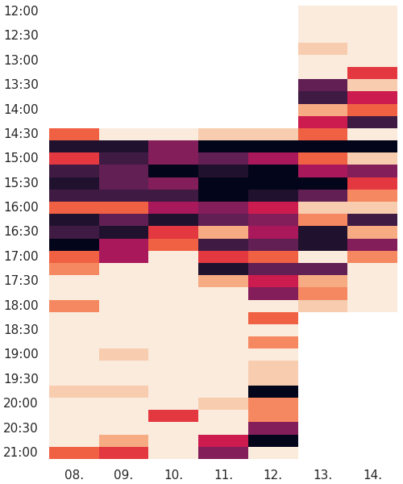
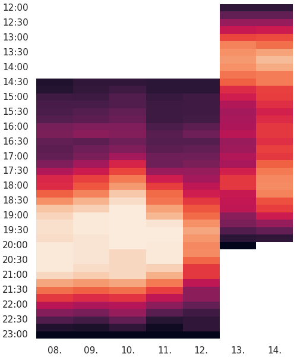

# Pebble Map

Microservice for creating heatmaps from Dr. Plano booking api

## Docker/Docker
### Build
```bash
podman build -t pebbleMap .
```
### Run
```bash
podman run -td -p 8041:8041 -e AUTH_TOKEN=$token --name pebbleMap pebbleMap
```

## Authentication

All request need an Authentication token. Use ether the `Authentication` header or send the token via the GET
Parameter `token` e.g. `token=abc123`

## API Parameter

### General

| Parameter    | required   | description |
|--------------|------------|-------------|
| `start`      | optional   | Start date as POSIX timestamp e.g. `start=1637030000` |
| `end`        | optional   | End date as POSIX timestamp e.g. `start=1637123000`   |
| `course_id`  | required   | Dr. Plano course id        |

### Heatmaps

| Parameter    | required   | description |
|--------------|------------|-------------|
| `size`       | optional   | width and height of request image comma seperated in inches e.g. `size=5,6`  |
| `background` | optional   | background color as RGB or RGBA hex string e.g. `background=#f00f` or as named color e.g. `background=red`|

## Endpoints

### Get /api/slots/heatmap

Displays booked slots as heatmap

```bash
curl -H "Authorization: abc123" "http://0.0.0.0:5000/api/slots/heatmap?course_id=123456" --output heatmap.png
```



### Get /api/occupancy/heatmap

Displays estimate amount of people as heatmap

```bash
curl -H "Authorization: abc123" "http://0.0.0.0:5000/api/occupancy/heatmap?course_id=123456" --output heatmap.png
```



### Get /api/slots

Debug endpoint displays data used for booked slots heatmap

```bash
curl -H "Authorization: abc123" "http://0.0.0.0:5000/api/slots?course_id=123456"
```

```json
[
  {
    "capacity": 12,
    "end": "Mon, 01 Nov 2021 16:15:00 GMT",
    "participants": 3,
    "start": "Mon, 01 Nov 2021 14:15:00 GMT"
  },
  {
    "capacity": 12,
    "end": "Mon, 01 Nov 2021 16:30:00 GMT",
    "participants": 2,
    "start": "Mon, 01 Nov 2021 14:30:00 GMT"
  },
  "[...]"
]
```

### Get /api/slots

Debug endpoint displays data used for occupancy heatmap

```bash
curl -H "Authorization: abc123" "http://0.0.0.0:5000/api/occupancy?course_id=123456"
```

```json
[
  {
    "capacity": 48,
    "end": "Mon, 29 Nov 2021 22:15:00 GMT",
    "participants": 0,
    "start": "Mon, 29 Nov 2021 22:00:00 GMT"
  },
  {
    "capacity": 36,
    "end": "Mon, 29 Nov 2021 22:30:00 GMT",
    "participants": 0,
    "start": "Mon, 29 Nov 2021 22:15:00 GMT"
  },
  "[...]"
]
```